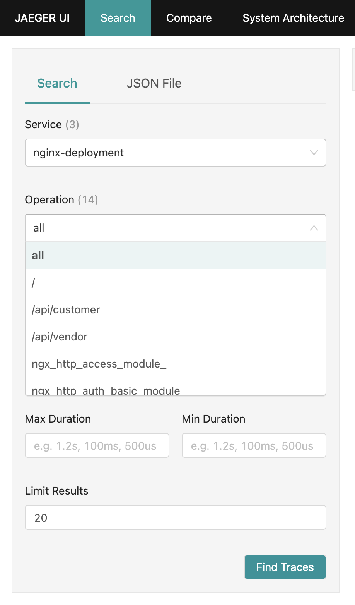

In my previous blog, we have explored the basic architecture of OpenTelemetry support in AppDynamics cSaaS, how hybrid agents work, how to use auto-instrumentation with mutating webhook with OpenTelemetry, and options for OpenTelemetry Collector deployment. Then we deployed successfully our first application with hybrid agent and seen telemetry data from both native and OpenTelemetry feeds. 

If you looked at the results, I guess you doubtlessly asked – why to use OpenTelemetry at all with AppDynamics, since the native AppDynamics data supply so much more information than what we have from OpenTelemetry. And – you were certainly right – at least in this quite simple scenario. Consider, how AppDynamics hybrid agent generates telemetry data:

Img. 1 - AppDynamics Agent and Telemetry Data it Produces, Native and OpenTelemetry. 

Why are the two telemetry data kinds so different in their richness? One of the reasons is that OpenTelemetry support is in the early stages and still under development, so we can expect more on OpenTelemetry side of the things over time. The other reasons, in my opinion more important ones, however, come from different philosophy and architecture of both worlds.  

AppDynamics as a solution (as many other commercially available products) started (I assume) with a specific vision, persona-based use cases, functional specifications, etc., therefore as an end to end solution. 

OpenTelemetry community started with definition of telemetry data kinds (signals – traces, metrics, and logs), protocols (OTLP), architectural components (instrumentation libraries, collector, ...), and then has developed open implementations of those components, in parallel, with the full power of the community, with one important exception (at least so far) - the backends, where it has stayed very agnostic to the actual use of the data collected. There are even signal types not yet available in OpenTelemetry (CPU profiling data specification, for example, is under development now), while they have existed in commercial solutions for quite some time. 

When using OpenTelemetry, it’s then often on the collectors or backends to derive the data from the information delivered via OTLP which otherwise come right from an agent (or as called in OpenTelemetry, client library – I cannot get used to the terminological differences). There is a significant progress in the community in this area right now, as well as in the collector/agent configuration management. I suggest to watch https://opentelemetry.io/blog/ for news, especially related to the OpAMP and the Collector. 

## Do Something We Could Not Do Before

To see the value of OpenTelemetry support in AppDynamics cSaaS today, we will focus on scenarios, where it matters to use OpenTelemetry to our benefit. 

We are going to deploy an application consisting of a Nginx serving a static page as a sample application and working as a reverse proxy to microservices – “customers” and “vendors”, both supplying simple REST API - pretty common use case, especially the reverse proxy function. The application topology looks like this: 

Img. 2 – Topology of the Sample Application and Telemetry Data Streams  

This is something which could not be done with AppDynamics native agents only, since there is no AppDynamics native agent for Nginx as of today. Actually, one of my customers wanted to monitor Nginx requests like this a while ago and we had to stick to Nginx timeseries metrics only.

The goal will be to:  

- Run the whole application on Kubernetes 

- Use auto-instrumentation for all application components – yes, Nginx, too! 

- Monitor incoming transactions end to end 

- Send all the usual information to AppDynamics cSaaS controller to get the comfort of the end to end solution 

- Send the tracing information to Jaeger to explore the possibility to stream traces to multiple backend systems 

## How to 

Clone the repository with the instrumentator:  

~~~~~~~~~~~~~~~~~~~~~~~~~~~~~~~~~~~~~~~~~~~~~~~~~~~~~~~~~~~~~~~~~~~~~~~~~~~ 
git clone https://github.com/cisco-open/appdynamics-k8s-webhook-instrumentor.git
cd appdynamics-k8s-webhook-instrumentor/buildEnd/helm
~~~~~~~~~~~~~~~~~~~~~~~~~~~~~~~~~~~~~~~~~~~~~~~~~~~~~~~~~~~~~~~~~~~~~~~~~~~ 

Download the gist with prepared configuration files and manifests: 

 

~~~~~~~~~~~~~~~~~~~~~~~~~~~~~~~~~~~~~~~~~~~~~~~~~~~~~~~~~~~~~~~~~~~~~~~~~~~  
wget –O gist.zip  https://gist.github.com/chrlic/ed8be87db25142e87a5f2ed973958053/archive/baefdb98305a2f4280219f97964ac62511b9d6cf.zip 
~~~~~~~~~~~~~~~~~~~~~~~~~~~~~~~~~~~~~~~~~~~~~~~~~~~~~~~~~~~~~~~~~~~~~~~~~~~ 

Unzip the gist files:   

~~~~~~~~~~~~~~~~~~~~~~~~~~~~~~~~~~~~~~~~~~~~~~~~~~~~~~~~~~~~~~~~~~~~~~~~~~~ 
unzip gist.zip  
~~~~~~~~~~~~~~~~~~~~~~~~~~~~~~~~~~~~~~~~~~~~~~~~~~~~~~~~~~~~~~~~~~~~~~~~~~~ 
 

Edit the `values-hybrid.yaml` file – the values for instrumentor Helm chart 

Fill-in the correct information in the following section where there are placeholders (more detail in my earlier blog) 

~~~~~~~~~~~~~~~~~~~~~~~~~~~~~~~~~~~~~~~~~~~~~~~~~~~~~~~~~~~~~~~~~~~~~~~~~~~  

appdController: 
  host: <controller-hostname> 
  port: "443" 
  isSecure: true 
  accountName: <account-name> 
  accessKey: "<controller-access-key>" 
  # useProxy: true 
  # proxyHost: proxy.corm.com 
  # proxyPort: "8080" 
  otelEndpoint: https://<region>-sls-agent-api.saas.appdynamics.com 
  otelHeaderKey: "<OpenTelemetry-Key>" 
~~~~~~~~~~~~~~~~~~~~~~~~~~~~~~~~~~~~~~~~~~~~~~~~~~~~~~~~~~~~~~~~~~~~~~~~~~~ 

See the instrumentation template and rules for Nginx and Apache (yes, we can do Apache HTTPD, too!). The important parts are:

~~~~~~~~~~~~~~~~~~~~~~~~~~~~~~~~~~~~~~~~~~~~~~~~~~~~~~~~~~~~~~~~~~~~~~~~~~~ 
instrumentationTemplates:
  - name: Apache_Otel
    injectionRules:
      technology: apache/otel
      image: chrlic/autoinstrumentation-apache-httpd:1.0.2
      imagePullPolicy: Always
      applicationNameSource: label
      applicationNameLabel: appdApp
      tierNameSource: auto
      openTelemetryCollector: deployment-hybrid-agent-default
  - name: Nginx_Otel
    injectionRules:
      technology: nginx/otel
      image: chrlic/autoinstrumentation-apache-httpd:1.0.2
      imagePullPolicy: Always
      applicationNameSource: label
      applicationNameLabel: appdApp
      tierNameSource: auto
      openTelemetryCollector: deployment-hybrid-agent-default
...
instrumentationRules:
  - name: apache-otel-test
    matchRules:
      namespaceRegex: .*
      labels:
      - otel: appd
      - language: apache
      podNameRegex: .*
    injectionRules:
      template: Apache_Otel
  - name: nginx-otel-test
    matchRules:
      namespaceRegex: .*
      labels:
      - otel: appd
      - language: nginx
      podNameRegex: .*
    injectionRules:
      template: Nginx_Otel
~~~~~~~~~~~~~~~~~~~~~~~~~~~~~~~~~~~~~~~~~~~~~~~~~~~~~~~~~~~~~~~~~~~~~~~~~~~ 

and the the Nginx deployment, it's just needed to label the pod template with the right labels, `otel: appd` and `language: nginx` in this example:

~~~~~~~~~~~~~~~~~~~~~~~~~~~~~~~~~~~~~~~~~~~~~~~~~~~~~~~~~~~~~~~~~~~~~~~~~~~ 
  template:
    metadata:
      annotations:
        test: testval
      labels:
        app: nginx
        appdApp: My-instr-java-app
        otel: appd
        language: nginx
~~~~~~~~~~~~~~~~~~~~~~~~~~~~~~~~~~~~~~~~~~~~~~~~~~~~~~~~~~~~~~~~~~~~~~~~~~~ 

Here we use the results of another OpenTelemetry project – otel-webserver-module (https://github.com/open-telemetry/opentelemetry-cpp-contrib/tree/main/instrumentation/otel-webserver-module) and of the image with the webserver module built according to documentation of OpenTelemetry Operator’s support for auto-instrumentation  of Apache HTTPD (https://github.com/open-telemetry/opentelemetry-operator/tree/main/autoinstrumentation/apache-httpd) . The same image can be used for both Apache HTTPD server and Nginx.

Install Jaeger 

~~~~~~~~~~~~~~~~~~~~~~~~~~~~~~~~~~~~~~~~~~~~~~~~~~~~~~~~~~~~~~~~~~~~~~~~~~~ 
kubectl apply –f d-svc-jaeger.yaml 
~~~~~~~~~~~~~~~~~~~~~~~~~~~~~~~~~~~~~~~~~~~~~~~~~~~~~~~~~~~~~~~~~~~~~~~~~~~ 

Install the instrumentator 

~~~~~~~~~~~~~~~~~~~~~~~~~~~~~~~~~~~~~~~~~~~~~~~~~~~~~~~~~~~~~~~~~~~~~~~~~~~ 
helm install --namespace=mwh mwh . --values=values-hybrid.yaml 
~~~~~~~~~~~~~~~~~~~~~~~~~~~~~~~~~~~~~~~~~~~~~~~~~~~~~~~~~~~~~~~~~~~~~~~~~~~ 

Install the application 

~~~~~~~~~~~~~~~~~~~~~~~~~~~~~~~~~~~~~~~~~~~~~~~~~~~~~~~~~~~~~~~~~~~~~~~~~~~ 
kubectl apply –f app-*.yaml 
~~~~~~~~~~~~~~~~~~~~~~~~~~~~~~~~~~~~~~~~~~~~~~~~~~~~~~~~~~~~~~~~~~~~~~~~~~~ 

After a few seconds, when the application deploys and is instrumented, there will be a simple application available at the URL of Nginx service – in my case, since for the lab and small development I run Kubernetes on Colima on laptop, it is `http://localhost:8765/` - your hostname may be different based on your Kubernetes cluster setup.  

You should see something like this in your browser: 

Img. 3. - API Driver Simple Application 

Now it’s time to run some requests against the application API – there are four API endpoints published for the API driver. Hit the button `Customers & Vendors` and you should see responses from the Nginx shown on the bottom. Let it run for couple of minutes, see what URL’s are sent, have a coffee or tea, stretch your legs. 

## AppDynamics & OpenTelemetry - Closer Look

After a few minutes, it's time to look at the results. If you have read my last blog, you already know, there will be two applications created in AppDynamics – one for native AppDynamics telemetry, one for OpenTelemetry based. Let’s look at more detail this time. 

Img 4. - Two application for two telemetry data feeds 

Go to the native application first (the one without “_otel” suffix). You should see a flow map like this: 

Note the blue selector All Sources on the right / top. It means that now we have a combined flow map from both native and OTel telemetry data. It shows the best of both worlds in terms of supplied data. On the bottom of the screen, you’ll see two sets of base metrics, too.  

Now select AppDynamics selector and the flow map changes to: 

And you see only the tiers which supply the native AppDynamics telemetry data. Consequently, when selecting the OpenTelemetry selector, flow map changes to: 

 

And this time, you see the tiers supplying OpenTelemetry data, and the tier names have the “_otel” suffix.  

This works the same for the other application with the “_otel” suffix. So, why do we have two applications?  

## AppDynamics & OpenTelemetry & Business Transactions 

While the flow maps are combined into one view and we use the selectors, for other data it’s not that simple. Let’s have a look at one example – Business Transactions. Business Transactions represent the type of request sent to an application and give us a very useful way to quickly categorize requests based on their meaning and importance. The classification of HTTP requests is by default based on first 2 URL segments (and can be customized). The question is, does it behave differently for AppDynamics agents and OpenTelemetry agents? And for native and OTel telemetry data? 

Go to the “native” application and there to Business Transactions. You should see something like this: 

 

Here you see that Business Transactions were identified by the tiers “customers” and “vendors”, not by the Nginx – how come? It’s because here we only consider AppDynamics native data and the first tiers capable of supplying them are tiers “customers” and “vendors”. It’s possible you will not see the Tier column right away, if not, you can add it to the table view by View Options button.  

Now, let’s go to the OpenTelemetry monitored application – the one with the “_otel” suffix – and there to Business Transactions again. You should see this: 

 

Here we have both business transactions found by Nginx tier as we would expect, since Nginx is the first system our requests hit. (Please disregard the Node.js icon on the left – it's the default for any OTel tier of any kind.)  

This data dichotomy is a design choice – while a bit confusing at first, I believe it’s more useful than pretending there’s only one source of data, especially with hybrid agents. For example, you’ll see that the data from hybrid agents are often shifted in time between the native and OTel based metrics. While native data is sent typically every minute, OTel traces come continuously, but are delayed at the source for buffering, at the collector for buffering, then batched and evaluated on the backend for correlation, which adds unpredictable time shifts. So, in my opinion, it’s more honest not to create too much virtual reality here.  

## Jaeger Monitoring

Since we also installed Jaeger, let’s have a look at how our tracing data looks there. If you run Kubernetes on your laptop like me, it will be available at http://localhost:16686/, or choose your K8S hostname based on your environment. What is in AppDynamics tiers, in Jaeger it is services: 

If we select the Nginx service, there are Operations available for selection. Operations roughly correspond to Business Transactions in AppDynamics, it’s not the same though. Here we see the “/api/customer” and “/api/vendor” as well as many “module...” operations – that's because the Nginx OpenTelemetry client library monitors many of the typically used Nginx modules internally, too. That’s too much detail for AppDynamics typical use cases, but it may become handy sometimes.  

Let’s pick “/api/vendor” and select one trace – the waterfall view appears showing all the spans: 

 

This lab showed how we can use OpenTelemetry to achieve in AppDynamics something, we could not do before, and we have also seen that it’s not at all difficult. There will be many situations where OpenTelemetry will be that useful.  

## What's next?

There’s however one more are to be explored more closely – the Business Transactions / Operations. We have seen that the names found are just “/api/customer” and “/api/vendor” - that’s not very insightful, especially if we know the API structure. Ideally, we would want something like “/api/customer/{custId}/order/{orderId}” etc. Is there a way to get it? This will be the topic for next time. 

 